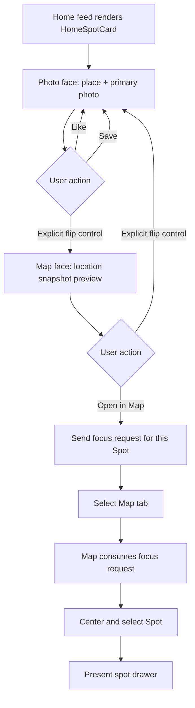

# Home Spot card flow

## Purpose

Show how the place-first Home card moves between its photo and map faces and hands a Spot to the in-app Map experience.

## Audience

Product, design, engineering, and QA.

## Flow

The card body does not implicitly flip. Face state is local presentation state and resets to the photo face when the card represents a different Spot. Reduce Motion replaces the 3D flip with a crossfade. **Open in Map** remains inside Spot and does not launch Apple Maps.

## Related docs

- [../product/home-feed.md](../product/home-feed.md)
- [../product/map-experience.md](../product/map-experience.md)
- [../product/user-flows.md](../product/user-flows.md)
- [../engineering/runtime-flows.md](../engineering/runtime-flows.md)
