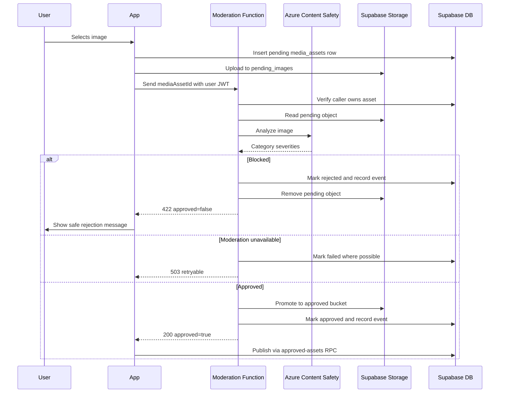

# Diagram: Image moderation sequence

## Purpose

Sequence for moderation-gated uploads.

## Audience

Engineering, safety.

## Current status

Verified for the Spot-image path. Profile avatars currently bypass this sequence.

## Details

## Related docs

- [../engineering/image-moderation.md](../engineering/image-moderation.md)

## Open questions / TODOs

- Route profile avatars through this sequence.
- Add cleanup for unlinked approved and failed assets.
