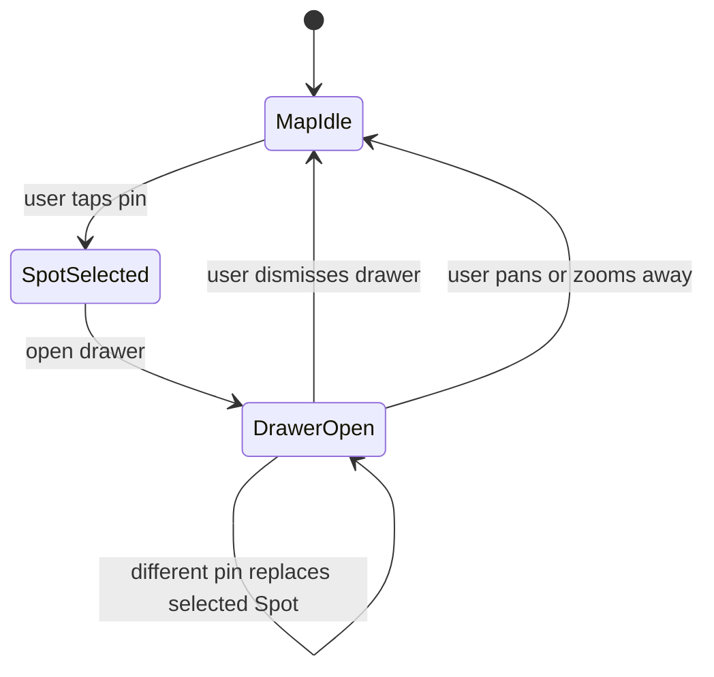

# Diagram: Map spot drawer

## Purpose

State-style view of map selection and drawer.

## Audience

Engineering, QA.

## Current status

Verified against map selection and drawer-policy tests.

## Details

## Related docs

- [../product/map-experience.md](../product/map-experience.md)

The drawer hosts `MapSpotPreviewCard` and the shared `SpotCard`; there is no separate `SpotDetailView` transition.

## Open questions / TODOs

- None.
