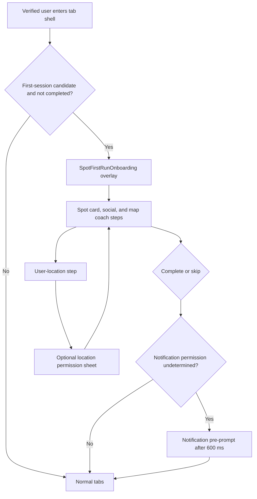

# Diagram: Onboarding

## Purpose

Visualize first-run onboarding relative to the main shell.

## Audience

Product and engineering.

## Current status

Verified against `SpotFirstRunOnboardingManager` wiring in `BottomTabNavigationView`. `HomeTourManager` is legacy and unmounted.

## Details

## Related docs

- [../product/onboarding.md](../product/onboarding.md)

## Open questions / TODOs

- None.
