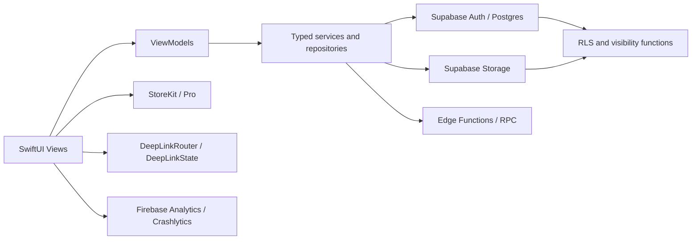

# Architecture

## Purpose

High-level view of the iOS app modules, data flow, and external systems.

## Audience

Engineers and Cursor agents onboarding to the repo.

## Current status

Matches SwiftUI + services layout under `Spot/` and **Supabase as the sole application data plane**. Firebase Analytics and Crashlytics initialize in `AppDelegate`; App Check is linked but not initialized.

## Details

### High-level architecture

### App directories (concise)

| Path | Role |
| --- | --- |
| `Spot/Views` | SwiftUI screens and components (`Auth`, `Home`, `PostFlow`, `Profile`, `Launch`, …) |
| `Spot/ViewModels` | `ObservableObject` state for screens |
| `Spot/Services/Auth` | Auth session, credentials, staging verification |
| `Spot/Services/Feed` | Home feed RPC, ranking helpers, flags |
| `Spot/Services/Spots` | Publish coordinator, drafts, vibe usage |
| `Spot/Services/Supabase` | `SpotSupabaseRepository` and related Postgres/Storage access |
| `Spot/Services/Subscriptions` | StoreKit manager, paywall routing |
| `Spot/Services/Social` | Follows, privacy cache, bookmarks collections |
| `Spot/Services/Profile` | Profile service, avatars, user spots |
| `Spot/Services/Core` | Deep links, token service |
| `Spot/Services/{Map,Moderation,Search,Media,Content,Analytics,Notifications}` | Domain services |
| `Spot/Supabase` | `SupabaseClient` bootstrap and environment selection |
| `Spot/Models` | Codable models |
| `Spot/Models/Logs` | `SpotLog` event enums (excluded from coverage scope) |
| `Spot/Utils` | Constants, logging, URL config, validators, extracted view policies |
| `Spot/Managers` | Cross-feature managers (e.g. onboarding tours) |
| `supabase/migrations` | Schema, RLS, storage, moderation SQL |

See also [`Spot/README.md`](../../Spot/README.md).

### Data flow (typical read)

View → ViewModel → Service/Repository → Supabase client → Postgres/Storage → RLS → decoded models → UI.

### Auth flow

`AuthService` + Supabase Auth session; `SpotAuthBridge` exposes current user id for gates (e.g. deep links). See [networking-and-auth.md](networking-and-auth.md).

### Feature read paths

| Surface | Path |
| --- | --- |
| Feed | `FeedViewModel` → `FeedRepository` → `FeedAPI` → feed RPCs |
| Map | `MapViewModel` → `MapViewportLoader` → `FeedAPI` → viewport RPC |
| Search | `SearchViewModel` → `SearchService` → `SpotSearchDataSource` / repository |
| Profile/social | `ProfileViewModel` → `ProfileService`, `UserSpotService`, `FollowRequestsService` |

`AuthorPrivacyCache` adds client-side filtering for Search and social changes; Supabase RLS remains authoritative. `FeedEventService` records visibility events, and `FeedDiversity` lightly reorders only the first hydrated home page.

### Posting (canonical modules)

| Module | Role |
| --- | --- |
| `PostFlowViewModel` | Composer state; builds `SpotPublishDraft` |
| `SpotPublishCoordinator` | Background publish queue, banners, success/failure notifications |
| `SpotSupabaseRepository` | Storage upload, moderation, `publish_spot_with_approved_media_assets_v1` RPC |

**Do not add** `SpotUploader` or Firestore/Firebase Storage upload paths. See [data-plane.md](data-plane.md).

### Media / storage flow

Pending buckets → moderation → approved buckets; see [storage-and-media.md](storage-and-media.md) and [image-moderation.md](image-moderation.md).

The implemented Spot-image path follows this architecture. Profile avatar uploads currently use the public legacy `avatars` bucket and are a documented exception that must be removed.

### Universal Links routing

`DeepLinkRouter.parseURL` → `DeepLinkState` navigation and pending link storage when unauthenticated. See [universal-links.md](universal-links.md).

### Logging

`SpotLogger` + per-area `SpotLog` enums; `LoggingConfig` applies DEBUG vs release behavior. See [logging.md](logging.md).

### Testing layout

- `SpotTests` — Swift Testing unit tests.
- `SpotUITests` — XCTest UI tests.
- Test plans: `Spot.xctestplan`, `SpotUITests.xctestplan`.

## Related docs

- [local-setup.md](local-setup.md)
- [supabase.md](supabase.md)
- [testing.md](testing.md)
- [runtime-flows.md](runtime-flows.md)

## Open questions / TODOs

- None blocking for architecture overview.
