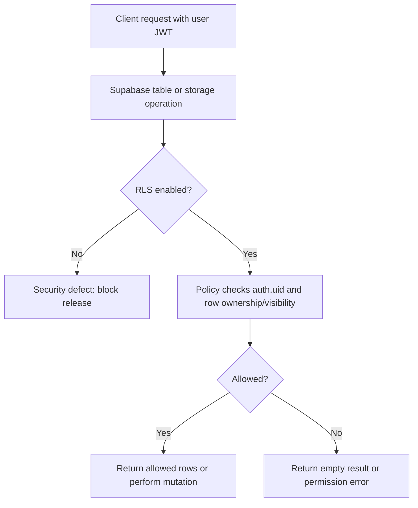

# Database and RLS

## Purpose

Principles for Row Level Security, privacy classes, migrations, and testing expectations.

## Audience

Engineers and DB reviewers.

## Current status

Authoritative policy definitions live in **`supabase/migrations/`**. The app assumes **RLS on** for user data paths.

## Details

### RLS principles

1. **Default deny** — users only read/write rows policies explicitly allow.
2. **Use `auth.uid()`** — tie rows to the authenticated user or visibility rules.
3. **Public reads** — only for data intentionally public (e.g. some spot fields); still validate in SQL.
4. **Mutations** — insert/update/delete must check ownership or role.

### Flow

### Table / policy inventory

Curated security-sensitive inventory from committed migrations:

- `media_assets`: authenticated owners can insert pending rows and select their own rows; clients cannot approve assets. `media_moderation_events`: service-role-only moderation audit.
- `terms_versions`, `user_terms_acceptances`: active legal versions and per-user acceptance records.
- `moderation_events`, `content_moderation_results`, and `moderation_queue`: service-role moderation audit and work queue.
- `spot_vibe_tags`: multi-vibe junction used by Pro publishing and discovery.
- `users`, `spots` (including `media_display_aspect_ratio`, `media_count`, `media_layout_version` for feed layout), `spot_images` (per-image width/height and clamped display ratio), follow-related tables (see dated migrations)
- `public.follows`: RLS policies `follows_select_related`, `follows_insert_self`, `follows_delete_related` (`20260502120000_security_sweep_rls_part_1.sql`); **unique** `(follower_id, followee_id)` via `follows_follower_followee_uidx` (`20260503120000_follows_unique_follower_followee.sql`)
- `public.reports`: client **insert only** (`reports_insert_own`); columns include `spot_id`, `reporter_id`, `owner_id` (must match `spots.user_id` for `spot_id`), `reason`, `details`, `block_requested`, `platform`, `app_version`, `created_at` (`20260502120000_security_sweep_rls_part_1.sql`, `20260507120000_reports_block_requested_insert_validation.sql`); **after insert** trigger `reports_apply_volume_suspension` sets `users.suspended_for_reports_at` when an author hits report thresholds (see `20260510120000_report_volume_suspension.sql`)
- **Report-volume suspension**: rolling **30 days**, **≥5** reports **and** **≥3 distinct reporters** against the same `owner_id` → `users.suspended_for_reports_at = now()` (idempotent). Effects: `can_view_author` / `users_public` hide them; `get_home_feed_v1` / `get_home_feed_status_v1` exclude their spots (`20260510120000_report_volume_suspension.sql`, `20260510120001_home_feed_rpc_report_suspension.sql`). **Unsuspend (support / SQL editor):** `update public.users set suspended_for_reports_at = null where id = '<uuid>';` — does **not** disable Supabase Auth; it only hides public app surfaces that respect `can_view_*` / feed RPCs.
- **Feed/map primary image bucket**: `get_home_feed_v1` and `get_map_spots_v1` return `primary_storage_bucket` from `spot_images.storage_bucket` so clients can sign against legacy `spots` or moderated `approved_spot_images` (`20260806015910_feed_map_primary_storage_bucket_v1.sql`).
- **Edit Spot atomic mutation**: `update_spot_editor_v1` validates the caller owns
  the Spot, preserves referenced existing `spot_images`, accepts only the
  caller's approved and unlinked replacement `media_assets`, and applies media
  order, cover metadata, vibes, and location in one transaction
  (`20260808215819_edit_spot_media_v1.sql`). The editor separately fetches all
  ordered image rows instead of trusting feed/map cover-only payloads. That
  migration also revokes authenticated direct writes to `spot_images` and
  removes legacy `spots` bucket write policies so clients cannot bypass image
  moderation; reads for visible legacy media remain supported.
- `public.staging_test_auth_attempts`: service-role-only attempt log for staging internal email verification rate limiting; RLS on, `anon`/`authenticated` revoked (`20260806191615_staging_test_auth_attempts_v1.sql`).
- `public.users_public`: view rows include self, users you **block** (so Blocked Users settings can resolve `username` / avatar), and existing discoverability rules for unblocked users (`20260502120000_security_sweep_rls_part_1.sql`, `20260508120000_users_public_include_block_list_targets.sql`)
- `public.user_blocks`: authenticated **select/insert/delete** on the table (RLS still applies); insert policy uses `user_blocks_duplicate_exists()` (**SECURITY DEFINER**, `row_security = off`) so duplicate checks do not recurse under FORCE RLS (`20260509120000_users_grants_user_blocks_insert_fix.sql`, `20260509130000_user_blocks_insert_policy_no_rls_recursion.sql`)
- `public.users`: **select/insert/delete** + column-scoped **update** for `authenticated` (`20260503120000_users_grant_authenticated_table_dml.sql`, `20260509120000_users_grants_user_blocks_insert_fix.sql`). The column-scoped update deliberately **excludes `id`** so users cannot rewrite their own primary key.
- **Username availability** uses `public.is_username_available(text)` (`SECURITY DEFINER`) so `anon` can receive one boolean without gaining table access (`20260727210000_username_availability_v1.sql`). The shared syntax is 3–20 ASCII letters, numbers, dots, underscores, or hyphens; separators cannot lead, trail, or appear consecutively. Normalization is `lower(btrim(username))`. The RPC is advisory; `users_username_normalized_uidx` atomically enforces final case-insensitive uniqueness.
- **User profile sync** goes through `public.sync_current_user_v1(...)` (**SECURITY DEFINER**, `search_path = public`), not a direct client upsert (`20260702120000_sync_current_user_security_definer_v1.sql`). A PostgREST `upsert(onConflict: "id")` compiles to `INSERT ... ON CONFLICT (id) DO UPDATE SET id = excluded.id, ...`; because `authenticated` lacks **update** on `id`, that failed for existing rows with **42501 permission denied for table users** (new users worked via the INSERT branch, returning users' sync silently failed). The RPC derives the row id from `auth.uid()`, only writes the caller's own row, and on conflict refreshes only login/heartbeat fields (`email`, `email_verified`, `last_active_at`, `locale`) while preserving user-managed fields (`username`, `username_lower`, `is_private`, `profile_image_url`, `is_pro`, `pro_until`).
- **Account deletion** uses the latest `delete_my_account` definition applied in migration order and removes `media_assets` rows after clearing references. Storage blobs are outside Postgres; current client cleanup does not cover all moderated buckets.

### Privacy classification (high level)

| Class | Examples | Access |
| --- | --- | --- |
| **Public** | Spot summaries visible on public profiles / map | RLS allows read for eligible viewers |
| **Private** | DMs if any, private profile fields | Owner / relationship-based |
| **System** | Moderation scores, internal IDs | Owner or service role only |

### Migrations

Add dated SQL under `supabase/migrations/`. Never edit applied migration files in production history—add new files to correct behavior.

### Testing RLS

- Use Supabase SQL editor with different `auth.uid()` contexts, or
- Integration tests with environment-specific test users. Unit tests cover client privacy and guard logic, but they do not prove live RLS policy behavior.

## Related docs

- [supabase.md](supabase.md)
- [networking-and-auth.md](networking-and-auth.md)
- [../diagrams/supabase-rls-flow.md](../diagrams/supabase-rls-flow.md)

## Open questions / TODOs

- Maintain machine-readable table inventory: TODO: confirm with owner.
