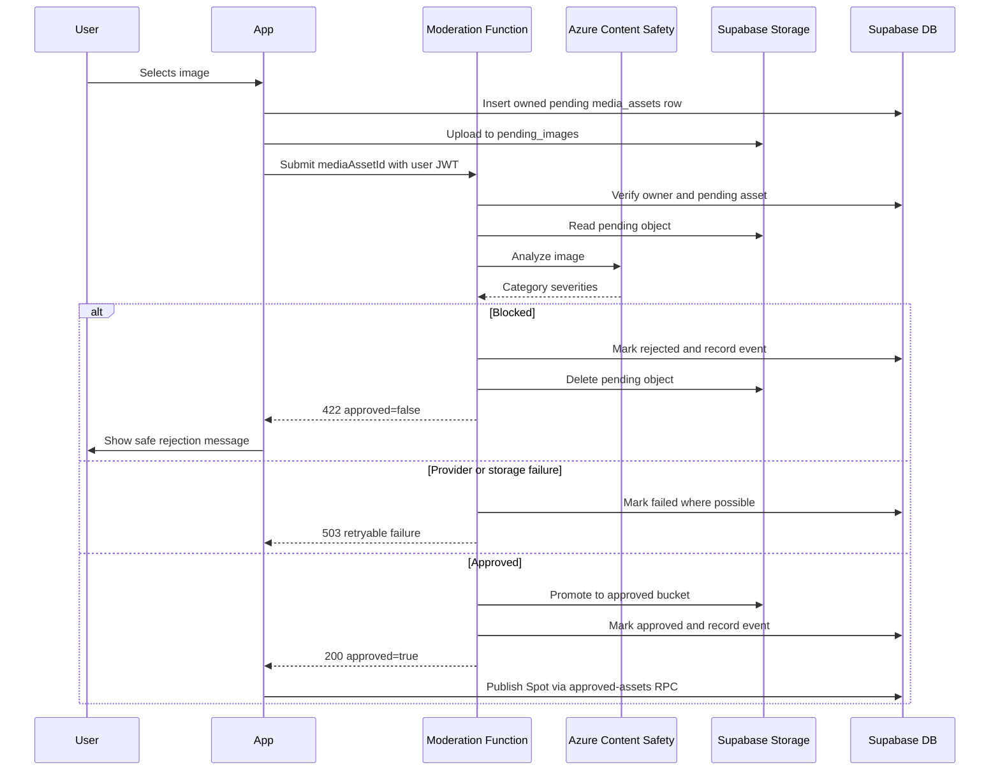

# Image moderation

## Purpose

Requirement and flow: every Spot image and profile image must be moderated before treat-as-approved paths are used.

## Audience

Engineers, safety, review.

## Current status

The Spot-image path is implemented through `supabase/functions/moderate-image/index.ts`. The profile-image schema exists, but the current iOS avatar uploader bypasses moderation; see the explicit gap below.

## Details

### Requirement

**Every** user-uploaded image for **Spots** or **profile pictures** must go through the moderation pipeline tied to `media_assets`—do not bypass with client-only checks.

### Client responsibilities

- Upload to pending storage only for new moderated assets.
- Invoke the function with the owned `mediaAssetId` and await its response.
- Show **safe** rejection messages when blocked.

### Server / function responsibilities

- Validate the caller JWT and `media_assets.owner_id`.
- Call **Azure Content Safety** with server-held credentials.
- Persist scores and outcomes on `media_assets` / `media_moderation_events`.
- Promote approved objects from pending to the appropriate approved bucket.
- Gate final publish on approved status.

### Threshold policy

Default Azure severity thresholds use a 0–6 scale and block at or above:

| Asset kind | Sexual | Violence | Hate | Self-harm |
| --- | ---: | ---: | ---: | ---: |
| `spot_image` | 4 | 4 | 4 | 4 |
| `profile_image` | 2 | 4 | 4 | 4 |

`MODERATION_THRESHOLDS_JSON` can override defaults in the deployed function environment. Policy changes require safety review and tests.

### Block / allow

- **Blocked** — user sees non-graphic explanation; no public approved path.
- **Allowed** — promote to approved bucket paths and allow RPC completion.

The function returns JSON containing `approved: boolean`. Policy rejection returns HTTP 422. Provider, configuration, or Storage failures return retryable HTTP 503. The client intentionally maps these to non-graphic user messages.

### Current profile-image gap

`SupabaseUserService.uploadProfileAvatarJPEG` writes directly to the public `avatars` bucket. It does not create `media_assets`, invoke `moderate-image`, or use `approved_profile_images`.

The product requirement remains that every profile image must be moderated, but that requirement is **not currently met**. Do not use the profile upload implementation as a pattern for new image flows.

### Logging

Use `SpotLogger` moderation category and repository logs; avoid logging raw image bytes or PII.

### Sequence (implemented Spot-image path)

## Related docs

- [storage-and-media.md](storage-and-media.md)
- [../diagrams/image-moderation-flow.md](../diagrams/image-moderation-flow.md)
- [environment-variables.md](environment-variables.md)

## Open questions / TODOs

- Migrate profile avatars to the implemented moderation architecture.
- Add cleanup for approved-but-unlinked and failed media.
- Verify deployed threshold overrides separately in each Supabase environment.
