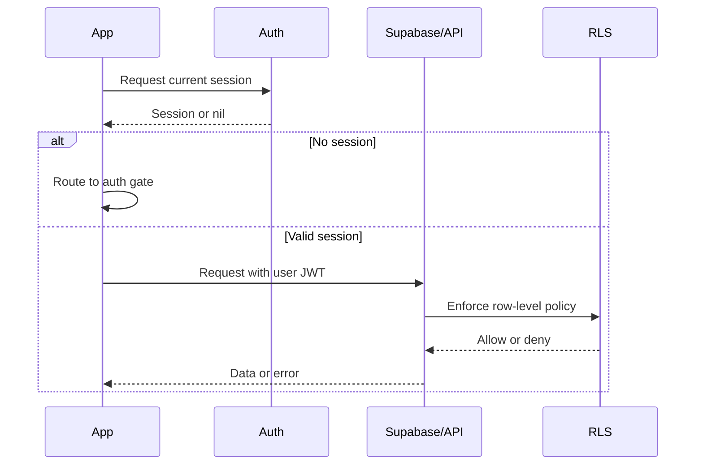

# Networking and authentication

## Purpose

Session expectations, authenticated requests, and security rules for client ↔ Supabase.

## Audience

Engineers and security reviewers.

## Current status

Auth via Supabase (`AuthService`, `Spot/Supabase`). Requests use user JWT from the Supabase client; **RLS** enforces access on the server.

## Details

### Authenticated requests

The Supabase Swift client attaches the current session JWT to Postgres and Storage calls. Treat **401/403** and empty RLS-filtered results as expected when unauthenticated or unauthorized.

### App launch

`RootView` and app entry coordinate session restoration, email confirmation flows, and tab shell vs welcome—see `Spot/Views/RootView.swift` and `SpotApp`.

### Session refresh

The Supabase client persists its session in device-local Keychain storage and emits the initial session through `authStateChanges`. `AuthViewModel` explicitly refreshes an expired initial session and returns to a recoverable signed-out state when refresh fails.

An in-place update and a reinstall on the same phone retain a still-valid local session. `FreshInstallDetector` resets install-scoped caches and permission markers but must not sign the user out.

Supabase access and refresh tokens are never configured as synchronizable Keychain items. Copying one rotating refresh token across devices can invalidate sessions and is not the new-device SSO strategy.

### Logout scope

User-initiated logout uses Supabase’s **local** sign-out scope. It removes the current device session without revoking sessions on the user’s other devices. Account deletion still removes the account and clears the saved account hint.

### Credential and recovery storage

- Passwords, OTP values, Apple identity tokens, and Supabase tokens are never stored by Spot application code.
- `AuthVerificationRecoveryStore` keeps only the pending email and start time in device-only Keychain storage so signup OTP can resume after relaunch.
- `AuthAccountHintStore` keeps a removable device-local account suggestion for the returning-account screen.
- Login fields use `.emailAddress`, `.username`, `.password`, and `.newPassword` content types as appropriate so Apple Password AutoFill can offer credentials managed by the operating system.
- Sign in with Apple requests use a cryptographically random nonce. The request receives the SHA-256 nonce while Supabase receives the raw nonce with the Apple ID token.

For testing, the Settings bundle’s **Clear Keychain on Next Launch** switch triggers `DebugKeychainReset` before `AuthViewModel` and the global Supabase client are initialized. The one-shot reset removes only Spot’s known authentication Keychain entries and turns itself off. A full app quit and relaunch is required. Remove or disable this control before the App Store release candidate.

### New-device SSO and passkeys

Current supported new-device paths are Sign in with Apple and iCloud Password AutoFill. Spot does not synchronize its own Supabase refresh tokens or raw credentials.

Supabase passkeys are a planned backend/configuration workstream:

1. Upgrade to a reviewed `supabase-swift` release with passkey support.
2. Enable passkeys in Supabase Auth.
3. Configure `spotapp.online` as the relying-party domain.
4. Add `webcredentials:spotapp.online` to the app entitlement.
5. Publish the matching `webcredentials` Apple App Site Association entry.
6. Register passkeys only for authenticated, verified accounts.
7. Verify registration, second-device sign-in, recovery, revocation, and account deletion on physical devices.

The current Supabase Swift passkey surface is experimental and must not be presented as functional before this work is complete.

### Unauthenticated users

- Deep links to Spots may be **stored** in `DeepLinkState.pendingDeepLink` until sign-in (`processPendingDeepLinks()`).
- Posting and mutations must be blocked at UI and still denied by RLS if attempted.

### Security expectations

1. **Never trust client-only checks** for authorization.
2. **RLS** must enforce row and storage access for every sensitive table/bucket.
3. **Posting** requires an authenticated user aligned with `auth.uid()` in policies.
4. **Sensitive data** must not appear in logs in production.
5. **Never return a private email address from an anonymous username-resolution RPC.** Release login is email-only until username authentication has a server-side design that does not disclose email.

### Sequence (conceptual)

## Related docs

- [database-and-rls.md](database-and-rls.md)
- [../product/user-flows.md](../product/user-flows.md)

## Open questions / TODOs

- Verify production access-token lifetime, refresh-token rotation, and reuse interval in Supabase.
- Decide whether to offer an explicit “Log out all devices” security action in addition to local logout.
- Complete the passkey workstream in the authentication reliability PRD before enabling its UI.
