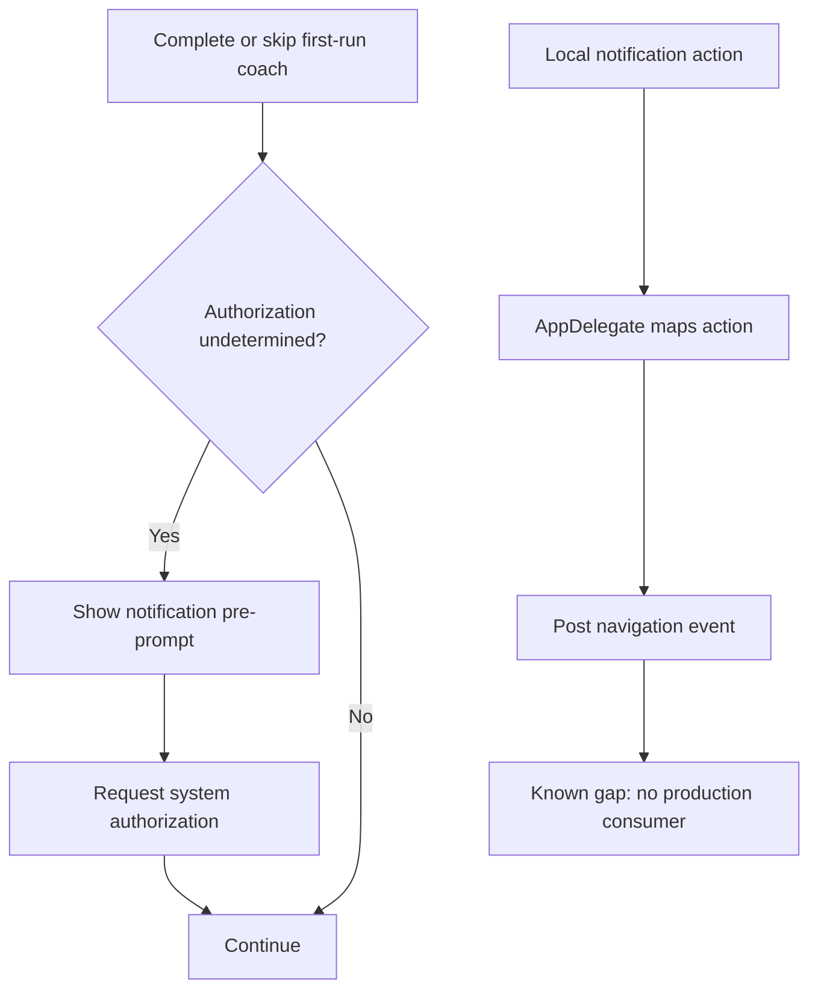

# Notifications

## Purpose

Document notification permission, delivery, action handling, and current production limitations.

## Audience

Engineering, product, QA, and operations.

## Current status

Spot registers UserNotifications categories and can schedule local notifications. It does **not** register for remote notifications, store APNs tokens, or have a push backend. Notification action events are posted but are not consumed by production navigation.

## Permission flow

1. The user completes or skips `SpotFirstRunOnboardingManager`.
2. After 600 ms, `BottomTabNavigationView` checks authorization.
3. If status is `.notDetermined`, it presents `NotificationPermissionView`.
4. `PermissionManager` requests system authorization and tracks the result.

Permission is contextual and does not block authentication or the tab shell.

## Registration and delivery

`AppDelegate.application(_:didFinishLaunchingWithOptions:)`:

- calls `NotificationService.shared.registerNotificationCategories()`;
- sets `UNUserNotificationCenter.current().delegate`;
- shows banner, sound, and badge for foreground local notifications.

Registered categories:

| Category | Actions |
| --- | --- |
| `FOLLOW_REQUEST` | Accept, View |
| `FOLLOW_ACCEPTED` | View profile |

`NotificationService` contains helpers for follow-request-received and follow-accepted local notifications.

## Current behavior

### Follow request received

The scheduling helper exists but has no call site when another user creates a request. The profile flow polls the pending-request count; it does not schedule a notification. Cross-device delivery requires a push backend.

### Follow request accepted

`FollowRequestsService.accept()` schedules a local “accepted” notification on the device performing the acceptance. That is the acceptor's device, not reliably the original requester's device. This is not a substitute for server-triggered push and should not be described as notifying the requester.

## Action handling

The `UNUserNotificationCenterDelegate` extension in `Spot/AppDelegate.swift` maps taps/actions to:

- `.navigateToFollowRequests`;
- `.navigateToFollowRequestsAndAccept`;
- `.navigateToProfile`.

No production view currently observes these events. Tapping an action foregrounds the app, but the intended navigation is not wired.

## Security requirements for future push

A production implementation needs:

1. APNs registration and token rotation handling in the app.
2. An RLS-protected device-token table keyed to the authenticated user and installation.
3. Server-triggered delivery after authoritative database changes.
4. Server-held APNs credentials; never a service-role or APNs private key in the client.
5. Generic notification copy that does not expose private content on a lock screen.
6. Token removal on sign-out/account deletion and invalid-token feedback handling.
7. Navigation that revalidates auth, relationship, and content visibility rather than trusting payload IDs.

## Flow

## Testing

Current useful checks:

- complete and skip onboarding paths both offer permission when undetermined;
- category identifiers and action mappings remain stable;
- foreground local delivery uses banner, sound, and badge;
- denied authorization does not block app use.

Do not write a test that claims the requester receives a follow-accepted notification until remote delivery exists. End-to-end action navigation should remain marked unavailable until consumers are wired.

## Known limitations

- Local notifications only; no APNs device-token registration or backend.
- Follow-request-received helper has no trigger.
- Follow-accepted local notification is scheduled on the wrong user's device for the intended social event.
- Action navigation events have no production consumers.
- No notification preference UI or notification history.

## Related docs

- [runtime-flows.md](runtime-flows.md)
- [networking-and-auth.md](networking-and-auth.md)
- [../product/onboarding.md](../product/onboarding.md)
- [../product/profiles-and-social.md](../product/profiles-and-social.md)
