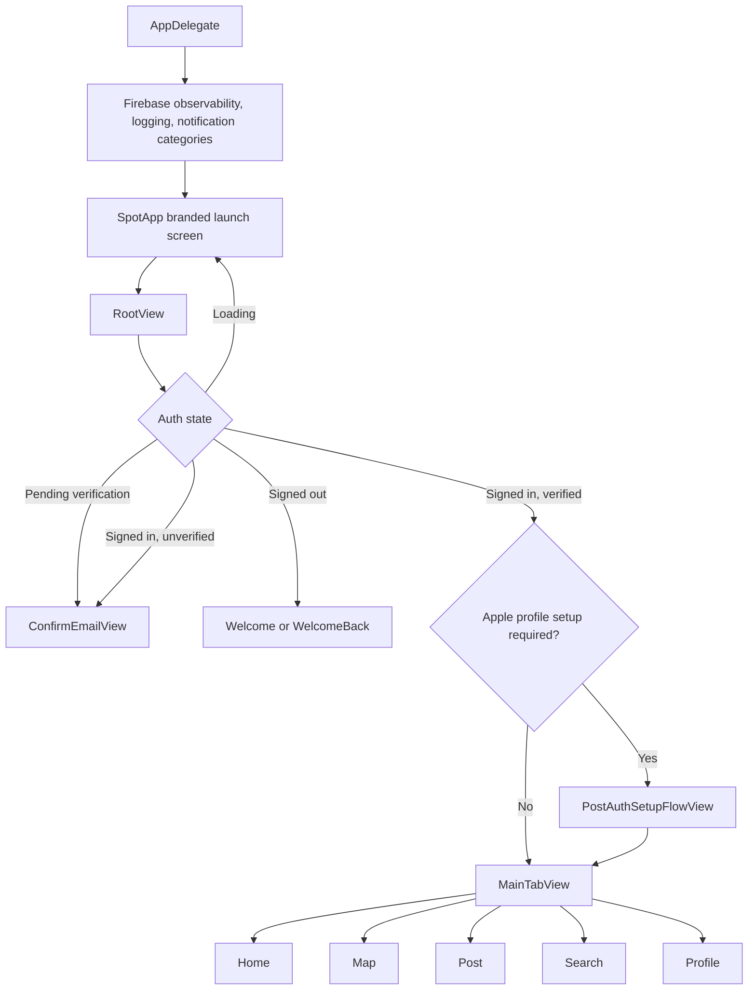
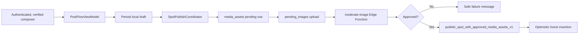

# Runtime flows and source map

## Purpose

Provide a code-verified map of Spot's major runtime flows and the boundaries between SwiftUI, view models, services, Supabase, and platform integrations.

## Audience

Engineers, reviewers, QA, support, and Cursor agents.

## Current status

Verified against the repository on 2026-07-28. This is the concise system map; feature pages contain product detail and diagrams contain focused visual flows.

## Application shell

`SpotApp` owns `AuthViewModel`, wraps `DeepLinkState.shared`, and injects `PermissionManager.shared`. `RootView` owns the auth gate, tab shell, paywall sheets, subscription success, and deep-link Spot overlays. The updated-terms gate exists but is disabled by `RootView.isTermsUpdateGateEnabled`.

## Shared state and cross-feature events

| Boundary | Responsibility |
| --- | --- |
| `AuthViewModel` | Session-derived identity, verification, likes, bookmarks, blocks, and effective Pro state |
| `SpotAuthBridge` | Minimal session identity bridge for non-SwiftUI gates such as deep links |
| `DeepLinkState` | Pending route, Spot fetch, unavailable state, subscription return |
| `PermissionManager` | Location, notification, photo, and camera authorization state |
| `SpotPublishCoordinator` | Background publish state and global success/failure banner |
| `NotificationCenter` events | Tab selection, paywall, publish completion, and immediate feed removal |

Most services are shared singletons. Screen-owned view models use `@StateObject` and call typed service or repository boundaries.

## Read flows

| Surface | Runtime path | Pagination / cache |
| --- | --- | --- |
| Home | `HomepageView` → `FeedViewModel` → `FeedRepository` → `FeedAPI` → `get_home_feed_v1` | 24 rows; server impression dedupe, client dedupe; first-page `FeedDiversity` |
| Map | `MapView` → `MapViewModel` → `MapViewportLoader` → `FeedAPI.get_map_spots_v1` | Viewport request; 250-pin cap; 60-second actor cache |
| Search | `SearchView` → `SearchViewModel` → `SearchService` → `SpotSearchDataSource` / repository | 24-row offset pages for Spot grids |
| Profile | `ProfileView` → `ProfileViewModel` → `ProfileService` / `UserSpotService` | Visibility check before loading private-author Spots |
| Deep-link Spot | `AppDelegate` or `RootView` → `DeepLinkRouter` → `DeepLinkState` → `SpotService` | Pending while signed out; duplicate-route debounce |

All application data reads use Supabase. RLS and server visibility functions are authoritative; `AuthorPrivacyCache` is an additive client-side filter.

## Spot presentation

There is no dedicated `SpotDetailView`. `SpotCard` is the shared detail presentation:

- inline in the home feed;
- inside the map spot drawer through `MapSpotPreviewCard`;
- selected from Search or profile grids;
- full-screen over the tab shell for deep links.

`SpotImageGallery` lazily fetches and signs the full image set after the primary image is shown.

## Write and safety flows

Reporting uses `submit_content_report`. Blocking from current UI paths inserts into `user_blocks`; database triggers create the audit event and visibility functions remove blocked authors. Account deletion reauthenticates, performs best-effort client storage cleanup, then calls `delete_my_account`.

## Platform integrations

| System | Current role |
| --- | --- |
| Supabase | Auth, Postgres, RLS, Storage, Edge Functions, application data |
| Firebase | Analytics and Crashlytics initialization; App Check is linked but not initialized in app code |
| StoreKit 2 | `spotPro` purchase, restore, and transaction updates |
| MapKit / Core Location | Map rendering, viewport discovery, location permission |
| UserNotifications | Permission and local notification categories; remote push is not implemented |
| Azure Content Safety | Server-side Spot-image analysis through `moderate-image` |

## Verified known limitations

These are implementation gaps, not target behavior:

- Profile avatars currently upload directly to the public `avatars` bucket and do not use the moderation pipeline.
- Home-feed batch signing assumes the legacy `spots` bucket while newer media records can use `approved_spot_images`.
- Failed or timed-out multi-image publishes can leave unlinked approved assets; draft recovery copy can overstate recoverability.
- Notification actions post navigation events, but no production view consumes those events.
- The Pro map "Following" filter currently receives an empty followed-user ID set.
- Base SQL definitions for some production feed/map RPCs are not fully represented in repository migrations.

See the linked safety and feature docs before changing these paths.

## Source index

| Concern | Primary paths |
| --- | --- |
| Launch and root gate | `Spot/SpotApp.swift`, `Spot/AppDelegate.swift`, `Spot/Views/RootView.swift` |
| Tab shell | `Spot/Views/MainTabView.swift`, `Spot/Views/Components/BottomTabNavigationView.swift` |
| Auth | `Spot/Services/Auth/AuthViewModel.swift`, `Spot/Services/AuthService.swift` |
| Feed | `Spot/ViewModels/FeedViewModel.swift`, `Spot/Services/Feed/` |
| Map | `Spot/ViewModels/MapViewModel.swift`, `Spot/Services/Map/`, `Spot/Views/Home/MapView.swift` |
| Search | `Spot/ViewModels/SearchViewModel.swift`, `Spot/Services/Search/` |
| Profile/social | `Spot/ViewModels/ProfileViewModel.swift`, `Spot/Services/ProfileService.swift`, `Spot/Services/FollowRequestsService.swift` |
| Publish | `Spot/ViewModels/PostFlowViewModel.swift`, `Spot/Services/Spots/`, `Spot/Services/Supabase/SpotSupabaseRepository.swift` |
| Deep links | `Spot/Services/DeepLinkRouter.swift`, `Spot/ViewModels/DeepLinkState.swift` |

## Related docs

- [architecture.md](architecture.md)
- [data-plane.md](data-plane.md)
- [networking-and-auth.md](networking-and-auth.md)
- [storage-and-media.md](storage-and-media.md)
- [../product/user-flows.md](../product/user-flows.md)
- [../diagrams/README.md](../diagrams/README.md)
