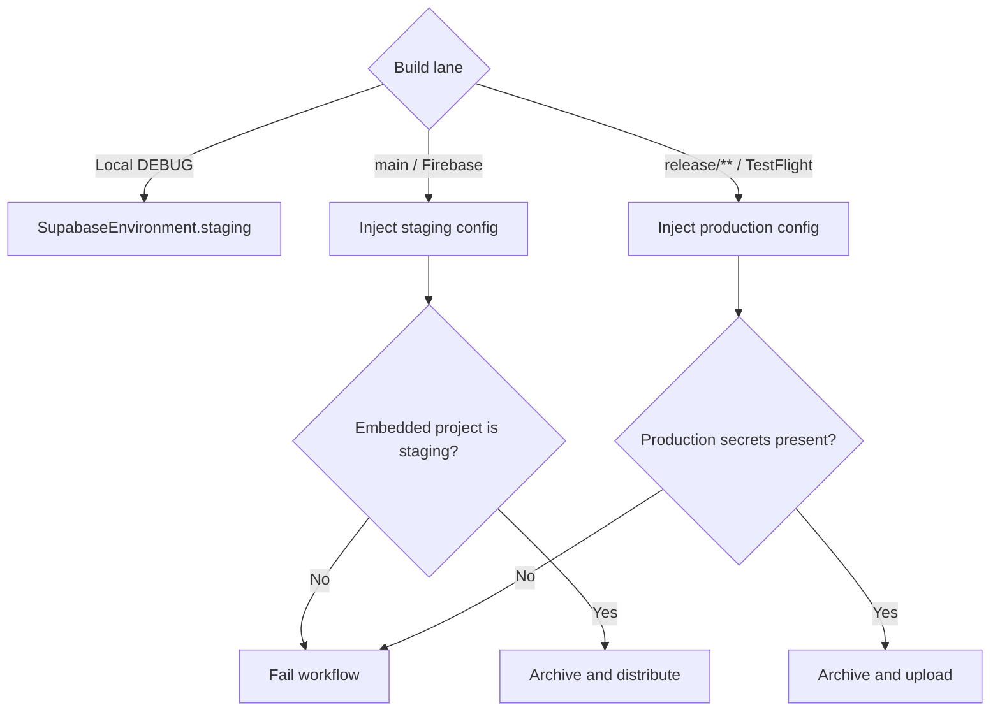

# Supabase environment strategy

## Purpose

Define Spot's implemented staging/production split, build routing, migration policy, and safety invariants.

## Audience

Engineering, infrastructure owners, release managers, and Cursor agents.

## Current status

**Environment routing is implemented.** Verified against `Spot/Supabase/Supabase.swift`, `.github/workflows/deploy.yml`, and `.github/workflows/testflight.yml` on 2026-07-28.

| Environment | Project ref | Used by | Configuration |
| --- | --- | --- | --- |
| Staging | `aeurigbbohyxvtsfiyul` | Local DEBUG, Firebase App Distribution from `main` | DEBUG enum defaults or staging workflow injection |
| Production | `gomdoguewaawdlvijahg` | TestFlight / App Store from `release/**` | Required GitHub Actions secrets injected into `Info.plist` |

The projects have isolated Auth, Postgres, Storage, and Edge Function deployments. Test data must never be copied into production.

## Decision

Spot uses two Supabase projects selected at build time:

- `#if DEBUG` selects staging in `SupabaseEnvironment.current`.
- Release loads `Spot/Info.plist` values first, allowing CI to select the intended project.
- Release enum values are fallback configuration, not the preferred distribution mechanism.
- Firebase distribution validates that the embedded URL belongs to staging before archiving.
- TestFlight requires production URL and publishable-key secrets and fails when they are absent.

The environment enum and loader live together in [`Spot/Supabase/Supabase.swift`](../../Spot/Supabase/Supabase.swift); there is no separate `SupabaseEnvironment.swift`.

## Build routing

| Lane | Branch / trigger | Supabase | Distribution |
| --- | --- | --- | --- |
| Local development | DEBUG | Staging | Simulator or signed device |
| PR CI | PR to `main` | No live backend required for unit tests | Test artifacts |
| Internal testing | Push to `main` | Staging | Firebase App Distribution |
| Release | Push to `release/**` | Production | TestFlight |

## Migration policy

1. Add reviewed, idempotent SQL under `supabase/migrations/`.
2. Apply and validate in staging first.
3. Exercise affected auth, RLS, RPC, Storage, and Edge Function paths with test accounts.
4. Apply the identical migration to production through the approved Supabase MCP workflow.
5. Verify migration history and a focused production smoke test.

Do not edit production schema ad hoc and then backfill a migration later. A migration is incomplete until the linked project application succeeds or the owner explicitly opts out.

### Parity checks

Compare these between environments without copying user data:

- migration history and public tables;
- RLS enabled state and policy names;
- functions and execute grants;
- Storage bucket names, visibility, and object policies;
- Edge Function versions and required secret names;
- Auth provider and redirect configuration.

Schema parity does not mean data parity. Staging can be reset and seeded; production cannot.

## Security invariants

- Never ship or document a service-role key.
- Publishable client credentials do not replace RLS.
- Keep production credentials in GitHub/Supabase secret stores.
- Never use production accounts or exports to seed staging.
- Deploy `moderate-image` and its Azure secrets separately in each environment.
- Validate Storage and RLS before enabling an app build against a new project.

## Operational verification

For Firebase builds:

1. Confirm the workflow reports the staging project ref.
2. Sign in with a staging-only account.
3. Verify feed, map, Search, profile, and moderated Spot publish.
4. Confirm created data exists only in staging.

For TestFlight builds:

1. Confirm production secrets were injected and artifact checks passed.
2. Use an approved production smoke-test account.
3. Verify auth, feed, deep links, Pro status, and one safe write path.
4. Avoid destructive account or bulk-data tests in production.

## Rollback

App rollback and database rollback are separate:

- Stop distributing a bad binary or upload a corrected build.
- Prefer forward-fix migrations. Only run destructive reversal SQL after reviewing data-loss impact.
- If an environment was misrouted, stop the lane, revoke affected sessions or credentials as appropriate, inspect writes, and follow the incident-response runbook.

## Known operational gaps

- Source control proves routing logic, not deployed schema parity or secret presence.
- The staging migration workflow is narrow and does not replace a general production migration runbook.
- The repository's `deploy-moderate-image.sh` is staging-oriented; production deployment must be deliberately targeted and verified.
- Some base feed/map RPC definitions are not fully represented in migrations, which limits reproducible project creation.

## Related docs

- [supabase-environment-setup-guide.md](supabase-environment-setup-guide.md)
- [environment-variables.md](environment-variables.md)
- [ci-cd.md](ci-cd.md)
- [database-and-rls.md](database-and-rls.md)
- [release-process.md](release-process.md)
- [../operations/incident-response.md](../operations/incident-response.md)
- [Firebase workflow](../../.github/workflows/deploy.yml)
- [TestFlight workflow](../../.github/workflows/testflight.yml)
