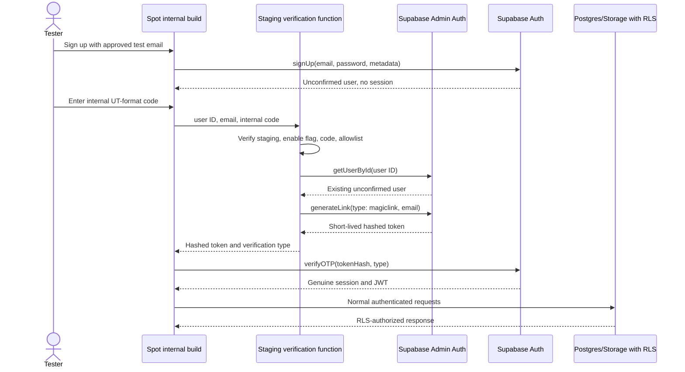

# Internal test email verification PRD

## Purpose

Provide authorized internal testers with a memorable non-production verification code, such as an `UT####` code, while still establishing a genuine Supabase session. The capability is intended to make repeated signup testing faster without adding SMS or weakening production email verification.

## Status

- **Stage:** Discovery and proposal
- **Priority:** P2 internal quality tooling
- **Owner:** TODO
- **Last reviewed:** 2026-07-28
- **Approval:** Product, Security, and Engineering approval required before implementation
- **Implementation:** Not started
- **Backend verification:** Supabase proof of concept still required

## Problem statement

Spot signup currently requires the six-digit code generated and emailed by Supabase. This is correct for production, but repeated internal account-creation tests depend on email delivery and inbox access.

A client-only bypass is not viable. When email confirmation is enabled, Supabase signup normally returns no session. Marking the account as verified only in the app would leave the client without a valid JWT, so RLS-protected feed, profile, social, storage, and posting operations would fail.

Supabase provides fixed test OTP configuration for SMS, but the hosted Auth implementation does not provide an equivalent fixed test OTP for email. Spot does not plan to add SMS for this requirement.

The closest equivalent to an internal `UT####` code is a staging-only server exchange that authorizes a designated test account, generates a real one-time Supabase email token, and lets the normal Supabase client exchange that token for a genuine session.

## Goals

- Let authorized testers complete email-signup verification with a memorable internal code.
- Return a genuine Supabase session and JWT so normal RLS behavior remains testable.
- Keep production signup and email verification unchanged.
- Avoid SMS providers and per-message SMS costs.
- Keep service-role credentials and the accepted internal code out of the app bundle and repository.
- Limit the capability to explicitly approved test accounts in an isolated staging project.
- Make accidental deployment or activation in production fail closed.
- Preserve the option to enter and verify the real emailed OTP in internal builds.

## Non-goals

- Replacing production email verification.
- Adding SMS authentication or SMS MFA.
- Bypassing Supabase sessions, JWT validation, or RLS.
- Creating a general impersonation or customer-support login tool.
- Allowing internal codes for arbitrary email addresses.
- Shipping the test code, service-role key, or allowlist in `Info.plist`, `Settings.bundle`, source code, or CI logs.
- Treating signup email confirmation as multi-factor authentication.
- Changing the production OTP email template, expiry, or resend limits.

## Current behavior and evidence

### Current client

- `SignupView` calls `supabase.auth.signUp` and enters pending verification when no session is returned: `Spot/Views/Auth/SignupView.swift`.
- `ConfirmEmailView` accepts six numeric characters and uses a number pad: `Spot/Views/Auth/ConfirmEmailView.swift`.
- `AuthViewModel.verifySignupEmailOTP` calls `supabase.auth.verifyOTP(email:token:type:.signup)`, then completes profile setup and synchronization: `Spot/Services/Auth/AuthViewModel.swift`.
- Verification recovery currently persists the normalized email and start time, but not the pending Supabase user ID: `Spot/Services/Auth/AuthCredentialStores.swift`.
- Local DEBUG builds select staging. Release builds prefer workflow-injected configuration: Firebase injects staging and TestFlight injects production.

### Distribution

- Firebase App Distribution builds a Release artifact but injects and validates **staging** Supabase configuration: `.github/workflows/deploy.yml`.
- TestFlight builds inject **production** Supabase configuration: `.github/workflows/testflight.yml`.
- There is no dedicated `INTERNAL_TESTING` Swift compilation condition.

Therefore, a `#if DEBUG` feature would work only for local DEBUG builds. Firebase App Distribution now targets staging, but an internal verification client still needs an explicit build/runtime gate because Firebase artifacts are Release builds.

### Supabase

- The staging Auth public settings reported email enabled and email auto-confirm disabled during discovery on 2026-07-27.
- Supabase Auth supports configured fixed OTPs for test phone numbers. Current Auth source applies that mechanism through SMS configuration only.
- A Send Email Hook receives the generated email token and token hash for custom delivery, but it does not replace the token accepted by Supabase Auth with a fixed code.
- The Admin `generateLink` API generates an email OTP and hashed token without sending an email. A client can exchange a valid token hash through `verifyOTP` to establish a session.
- The exact `generateLink(type: "magiclink")` behavior for an existing unconfirmed Spot staging user remains **TODO: verify** against the linked staging project.

## Proposed experience

### Production and TestFlight

- Show the existing six-digit email OTP experience.
- Do not display internal verification controls.
- Do not compile or enable the internal verification client.
- Do not deploy the internal verification Edge Function to the production Supabase project.

### Internal staging build

1. Tester signs up normally.
2. The standard six-digit OTP screen remains available.
3. An internal-only action, such as **Use internal test code**, opens a separate alphanumeric code field.
4. The tester enters the active `UT####`-format code.
5. The app requests a staging verification exchange.
6. On success, the app establishes a genuine Supabase session and follows the same post-verification path as a real OTP.
7. On failure, the tester remains on the verification screen and may retry or use the emailed code.

The internal code must use a separate field rather than changing the production six-digit OTP boxes. This preserves numeric OTP AutoFill, avoids ambiguous routing of mistyped real OTPs, and keeps the production UX unchanged.

## Proposed architecture

### Staging Edge Function

Add a function such as `staging-verify-email` under `supabase/functions/`.

The function must:

1. Accept POST requests only.
2. Run without an existing user JWT because signup confirmation occurs before a session exists.
3. Require:
   - pending Supabase user ID;
   - normalized email;
   - tester-entered internal code.
4. Fail unless its Supabase URL contains the approved staging project reference.
5. Fail unless `STAGING_TEST_AUTH_ENABLED` is explicitly enabled.
6. Compare the submitted code with a server-held secret.
7. Require the normalized email to match a server-held exact-email allowlist. Domain-only allowlisting is insufficient unless the domain is exclusively controlled for test accounts.
8. Load the user through the Admin API by ID and confirm:
   - the user exists;
   - the user email matches the submitted email;
   - the email is not already confirmed.
9. Generate a magic-link token for that existing user.
10. Return only the short-lived hashed token and required verification type.
11. Return generic errors that do not disclose whether an arbitrary account exists.
12. Never log the submitted code, email, token hash, access token, refresh token, or service-role credential.

The app should exchange the token hash itself so the Supabase Swift client owns normal session persistence and refresh behavior. The Edge Function must not return its service-role credential.

### Function secrets

The following names are proposed; values must exist only in Supabase staging Function Secrets:

| Secret | Purpose |
| --- | --- |
| `STAGING_TEST_AUTH_ENABLED` | Explicit server-side kill switch |
| `STAGING_TEST_AUTH_CODE` | Active internal code; never committed |
| `STAGING_TEST_AUTH_EMAILS` | Exact normalized test-email allowlist |

Supabase-provided server credentials remain in the function environment. No service-role or secret key may be added to the iOS app.

### Proposed client

The client implementation should:

- Introduce a dedicated `INTERNAL_TESTING` compilation condition for distributed internal builds.
- Compile the feature only under `DEBUG` or `INTERNAL_TESTING`.
- Also require `SupabaseEnvironment.current == .staging` at runtime.
- Keep the existing numeric OTP path unchanged.
- Send the pending user ID and normalized email only after the tester explicitly chooses internal verification.
- Exchange the returned hash using the Supabase Swift `verifyOTP(tokenHash:type:)` API.
- Reuse one post-verification completion method for real OTP and internal verification:
  - complete pending avatar upload;
  - clear recovery state;
  - synchronize the current profile;
  - refresh verified state.
- Surface unavailable, invalid-code, rate-limited, and configuration-error states without exposing account existence.

The internal code itself must not be embedded in Swift, `Info.plist`, `Settings.bundle`, launch arguments, or a plist-backed toggle.

### Pending verification recovery

The function must not generate or create a user from an email alone. The client should retain the pending Supabase user ID returned by signup and provide it during the exchange.

Implementation should extend `AuthVerificationRecovery` with an optional user ID while preserving compatibility with existing email-only records. Persisting the pending user UUID is acceptable; passwords, OTPs, token hashes, access tokens, and refresh tokens remain prohibited.

If a legacy recovery record has no user ID, internal verification is unavailable and the user must use the emailed OTP or restart signup.

## Environment and deployment requirements

### Required build lanes

| Lane | Build condition | Supabase | Internal verification |
| --- | --- | --- | --- |
| Local development | `DEBUG` | Staging | May be enabled |
| Firebase internal distribution | `INTERNAL_TESTING`, Release optimization | Staging | May be enabled |
| TestFlight/App Store | Production Release | Production | Must be absent |

Firebase already injects staging Supabase credentials. Before this feature can serve Firebase testers, the workflow must define a reviewed internal-testing compilation condition and verify both that condition and the staging project in the built artifact.

### Defense in depth

- A deployment script must hardcode the allowed staging project reference and reject the production reference.
- The Edge Function must independently verify its runtime Supabase URL.
- The production deployment workflow must not reference the function.
- Production must not contain `STAGING_TEST_AUTH_ENABLED`, the internal code, or the test-email allowlist.
- CI should scan production artifacts or generated build settings to confirm `INTERNAL_TESTING` is absent.
- CI should fail internal-distribution builds if their embedded Supabase project is not staging.
- The server kill switch must disable the exchange without requiring a new app build.

## Security and privacy requirements

This feature deliberately weakens proof of email ownership for named staging accounts. Those accounts must contain test data only.

- Use exact test-account allowlisting by default.
- Never allow arbitrary consumer email addresses.
- Never copy production users or production personal data into staging.
- Rotate the internal code after staff changes, suspected disclosure, or the agreed rotation interval.
- Remove accounts from the allowlist when access is no longer required.
- Apply request rate limiting by pending user ID and source where practical.
- Alert or review on repeated denied attempts without logging submitted credentials.
- Return generic unauthorized responses for invalid code, email, user ID, disabled configuration, and non-allowlisted accounts.
- Use constant-time comparison for the submitted code where supported.
- Expire generated tokens according to the normal Supabase Auth policy.
- Do not store the internal code or generated token in analytics, Crashlytics, `SpotLogger`, database rows, or client persistence.
- Do not expose an admin endpoint that accepts email alone and silently creates a user.
- Treat possession of the internal code plus an allowlisted email as access to that staging account.

### Abuse controls decision

The initial implementation must select and document one rate-limiting mechanism:

1. a service-role-only attempt table with a reviewed migration and no client policies;
2. a managed edge rate limiter; or
3. a documented staging-only limit enforced by an approved gateway capability.

An in-memory Edge Function counter is not sufficient because function instances are ephemeral and distributed.

## Cost

- No SMS provider is required.
- No SMS messages are sent.
- Admin `generateLink` creates a token but does not send an additional email.
- Each internal verification adds an Edge Function invocation and Auth token exchange.
- Normal QA volume is expected to be small, but actual function and rate-limiter quotas must be reviewed before approval.
- A managed rate limiter may add cost; the selected mechanism must be recorded before implementation.

## Observability

Record privacy-safe structured outcomes:

- request allowed or denied;
- disabled configuration;
- non-staging environment guard;
- allowlist failure;
- invalid internal code;
- rate-limited request;
- pending-user mismatch;
- token-generation failure;
- client token-exchange success or failure.

Do not record raw user IDs, emails, codes, token hashes, access tokens, or refresh tokens. Use an approved non-reversible correlation mechanism only if operational investigation requires account-level grouping.

## Failure behavior

| Condition | Expected result |
| --- | --- |
| Feature disabled | Internal action hidden or unavailable; real OTP remains usable |
| Production build | No internal client path |
| Production function invocation | Function absent; runtime guard would deny if accidentally deployed |
| Invalid internal code | Generic verification failure |
| Email not allowlisted | Generic verification failure |
| User ID and email mismatch | Generic verification failure |
| User already confirmed | Refresh auth state or ask tester to log in |
| Rate limit reached | Retry-later message |
| Token generation fails | Retain verification state and allow real OTP |
| Token exchange fails | Retain verification state; do not mark verified locally |
| No pending user ID after recovery | Require real OTP or restart signup |

No failure may set `isEmailVerified`, `isAuthenticated`, or a synthetic user ID without a Supabase session.

## Acceptance criteria

### Automated

- Production compilation cannot reference the internal verification service or UI.
- Internal verification routing requires both an eligible build and staging runtime.
- Existing numeric signup OTP verification remains unchanged.
- Unit tests cover internal feature disabled, invalid format, server denial, malformed response, token-exchange failure, and success completion.
- Unit tests confirm no local verified/authenticated state is set when session establishment fails.
- Recovery-store tests cover the optional pending user ID and legacy email-only records.
- Edge Function tests cover method validation, staging guard, kill switch, constant-time code comparison helper, allowlist denial, user mismatch, and generic error responses.
- Deployment guard tests reject the production project reference.
- CI verifies Firebase internal artifacts use staging and TestFlight artifacts use production.

### Manual staging

1. Allowlisted account signs up and completes verification using the internal code.
2. Resulting session survives relaunch and refresh.
3. The tester can read and mutate only data permitted by normal RLS.
4. Real emailed OTP still works in the same internal build.
5. Non-allowlisted account cannot use the internal code.
6. Wrong user ID, email, or code does not disclose account state.
7. Disabled server kill switch immediately blocks internal verification.
8. Rotating the function secret invalidates the old internal code.
9. A production-configured build cannot display or invoke the capability.
10. Firebase internal and TestFlight artifacts report the expected Supabase project.

## Proof-of-concept gates

Before implementation approval:

1. Authenticate the Supabase MCP connection for the Spot staging project.
2. Confirm the authoritative staging and production project references.
3. Verify staging Auth email-confirmation and OTP-template settings.
4. In an isolated staging test, confirm Admin `generateLink(type: "magiclink")` succeeds for an existing unconfirmed signup without creating a duplicate user.
5. Confirm the returned hash can be exchanged using the installed `supabase-swift` API and that the resulting user has `emailConfirmedAt`.
6. Confirm the exchange triggers the expected auth-state event and session persistence.
7. Confirm `sync_current_user_v1` succeeds after the exchange.
8. Choose the rate-limiting mechanism.
9. Decide whether Firebase App Distribution will move from production to staging.
10. Approve the exact test-account ownership and offboarding process.

Failure of the `generateLink` proof of concept must return the proposal to design. Directly updating `auth.users.email_confirmed_at` or marking the client verified without a session is not an acceptable fallback.

## Delivery workstreams

1. **Environment isolation:** define `INTERNAL_TESTING`, point Firebase internal distribution to staging, and add artifact checks.
2. **Backend proof of concept:** validate Admin link generation and token exchange in staging.
3. **Backend implementation:** add the guarded Edge Function, secrets, allowlist, rate limiting, tests, and staging-only deployment script.
4. **Client implementation:** retain pending user ID, add internal-only entry UI, invoke the function, exchange the token, and share post-verification completion.
5. **Security review:** threat-model the unauthenticated function, secret rotation, allowlist, telemetry, and accidental deployment.
6. **Operations:** document enable/disable, tester onboarding, code rotation, incident response, and function removal.

## Decisions required

| Decision | Recommended default | Owner |
| --- | --- | --- |
| Internal code format | `UT####`; actual value stored only as a function secret | Product/Security |
| Eligible accounts | Exact staging email allowlist | Security |
| Firebase backend | Move internal distribution to staging before enabling | Engineering/Release |
| Client exposure | Separate internal-only code action; preserve numeric OTP UI | Product |
| Session exchange | Return token hash; Supabase Swift performs `verifyOTP` | Engineering |
| Rate limiting | Required; select mechanism during proof of concept | Security/Engineering |
| Secret rotation | On access changes or suspected exposure; periodic interval TODO | Security |
| Production deployment | Prohibited | Release/Security |

## Alternatives considered

### Client-only verified flag

Rejected. It does not establish a Supabase session and cannot satisfy RLS.

### Fixed email OTP configuration

Unavailable in hosted Supabase Auth. The documented test OTP configuration is for SMS.

### SMS test OTP

Rejected for this requirement. Spot does not currently use SMS, and adding a provider expands cost, privacy, and authentication scope.

### Disable email confirmation in staging

Viable for broad staging convenience but does not test the verification UI or recovery flow. It also changes all staging signups rather than only allowlisted testers.

### Send Email Hook and test inbox

Safer because it preserves generated OTPs, but it does not provide a memorable fixed code. It remains a useful fallback for staging email-delivery testing.

### Settings or plist toggle

Rejected as the authorization mechanism. A plist-backed value is client-controlled and cannot safely confirm a Supabase user. A non-secret internal-build flag may control UI visibility, but the server must independently authorize every exchange.

### Admin confirmation without session generation

Rejected. Updating email confirmation alone does not establish the client session needed by RLS-protected features.

## Related code and documentation

- [Authentication reliability release PRD](auth-reliability-prd.md)
- [Networking and authentication](../engineering/networking-and-auth.md)
- [Supabase environment strategy](../engineering/supabase-environment-strategy.md)
- [Environment variables and secrets](../engineering/environment-variables.md)
- [Testing](../engineering/testing.md)
- `Spot/Views/Auth/SignupView.swift`
- `Spot/Views/Auth/ConfirmEmailView.swift`
- `Spot/Services/Auth/AuthViewModel.swift`
- `Spot/Services/Auth/AuthCredentialStores.swift`
- `Spot/Supabase/Supabase.swift`
- `supabase/functions/moderate-image/`
- `.github/workflows/deploy.yml`
- `.github/workflows/testflight.yml`
