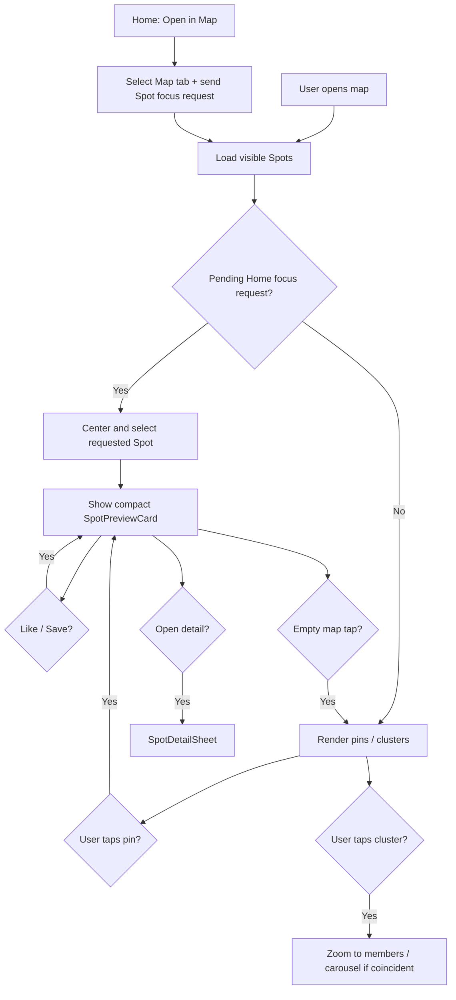

# Map experience

## Purpose

Describe map discovery: pins, clustering, compact spot preview, expanded detail, permissions, and Pro-related map behavior.

## Audience

Product, engineering, QA.

## Current status

Map UI lives under `Spot/Views/Home/MapView.swift`, `MapExperience`, `SharedSpotMap`, `MapControlsOverlay`, `SpotPreviewCard`, and `SpotDetailSheet`. Profile Map reuses the same `MapExperience` shell via `ProfileMapView`.

## Details

### Experience

The **map** lets users discover Spots near a viewport: markers (with MapKit clustering), selection, a **compact floating preview** for glance + Like/Save, and an optional **expanded detail sheet**.

Interaction model:

1. Map (full viewport)
2. Tap spot → compact actionable preview
3. Optionally open full Spot detail

Home can also initiate this flow. Choosing **Open in Map** from a `HomeSpotCard` sends an in-app focus request for that Spot and selects the Map tab. The Map consumes the request, centers on and selects the requested Spot, and opens its spot drawer. This preserves the Spot context without handing off to Apple Maps.

### Pins and clusters

- Individual markers are **photo preview pins** (`SpotAnnotationView`) — a 52 pt circular thumbnail of the spot's primary image inside a brand-green pin silhouette with a subtle shadow and a crisp point at the geographic anchor. The tip is the exact coordinate and never shifts between loading, loaded, and selected states.
- Portrait thumbnails are cropped with a 10% downward bias (`SpotPhotoPinContentsRect`) so outdoor spots don't waste the top of the pin on sky. Landscape and square photos keep the full frame.
- Spots that have no image URL (or when `MapMarkerFeatureFlags.photoPinMarkersEnabled` is off) fall back to the branded teardrop pin, so no spot is ever left without a marker.
- Marker thumbnails go through `MapMarkerImageCache`, a bounded `NSCache` (400 items / 16 MB by default) with `ImageIO` downsampling and in-flight request de-duplication. Pan/zoom bursts cannot fan out into repeat network requests for the same URL.
- Dense regions use MapKit `MKClusterAnnotation` with branded count badges (`SpotClusterAnnotationView`). Photo pins share the same `clusteringIdentifier`, so clustering behavior is unchanged.
- Tapping a cluster zooms toward its members. Coincident spots at max zoom open a horizontal carousel in the preview slot.
- Selected markers scale by `Constants.MapDesign.pinSelectedScale` and are promoted to `zPriority = .max`, so a selected photo pin always renders above surrounding pins.

### Compact preview / detail

- Tapping a spot opens `SpotPreviewCard` (~120–140 pt) with thumbnail, author, location, Like, and Save — no scrolling required for primary actions.
- Tapping empty map space dismisses the preview (camera is **not** restored).
- Tapping another marker replaces preview content without dismiss/re-present flicker.
- Swipe up / tap card body opens `SpotDetailSheet` with a persistent Like/Save/Share action bar.
- Filter changes preserve the current camera; returning from detail preserves camera and selection.

### Profile Map

- Full-bleed map with a floating context capsule (`‹ [avatar] username · N spots`).
- No large static profile header above the map.
- Same markers, clustering, preview, and detail as the Global Map.

### Pro filtering

Pro-only filters cover vibe, saved, liked, and following. `MapFilterGate` hides filter controls for non-Pro users. Active pills use dark-green fill + off-white text. Filters are applied client-side to viewport RPC results.

The Following filter is a known limitation: `MapView` currently passes an empty followed-user ID set, so that filter cannot return matching markers until social graph state is wired into the map.

### Location permission

Map and discovery may request location; prior prompt state is tracked in `UserDefaults` keys in `Constants.UserDefaultsKeys`.

- The map remains usable with a continental-US fallback before permission or when permission is denied.
- Granting permission from the native prompt or Settings triggers a location request while the map is open.
- The current-user marker uses the signed-in profile image when available and falls back to username initials or a person symbol.

### Analytics

Firebase events (via `MapAnalytics`): `map_marker_impression`, `map_marker_tapped`, `map_marker_image_load` (diagnostic), `map_cluster_tapped`, `map_spot_preview_shown`, `map_preview_liked`, `map_preview_saved`, `map_preview_opened`, `map_preview_dismissed`, `map_filter_changed`, `map_recenter_tapped`.

`map_marker_impression` and `map_marker_tapped` both carry a `marker_type` property (`photo_pin` or `teardrop`) plus an approximate `zoom_level`, so photo pin engagement can be compared against the legacy pin during rollout. Impressions are deduplicated per attach cycle — panning a marker back into view during the same map session does not double-count.

### Flow diagram

## Related docs

- [home-feed.md](home-feed.md)
- [../diagrams/home-spot-card-flow.md](../diagrams/home-spot-card-flow.md)
- [../diagrams/map-spot-drawer-flow.md](../diagrams/map-spot-drawer-flow.md)
- [pro-subscription.md](pro-subscription.md)
- [../engineering/logging.md](../engineering/logging.md)

## Open questions / TODOs

- Wire followed-user IDs into the Pro Following filter.
