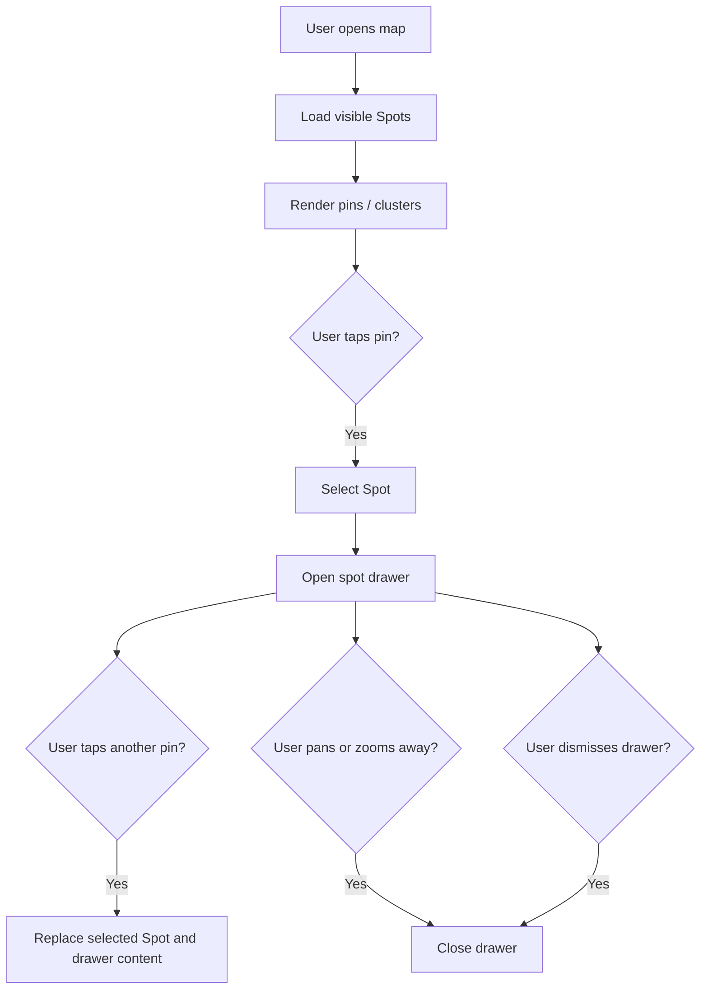

# Map experience

## Purpose

Describe map discovery: pins, clustering, spot drawer, permissions, and Pro-related map behavior.

## Audience

Product, engineering, QA.

## Current status

Map UI lives under `Spot/Views/Home/MapView.swift`, `SharedSpotMap`, `MapControlsOverlay`, `MapSpotPreviewCard`. Drawer dismiss policy is covered by unit tests such as `SpotTests/MapDiscoveryDrawerPolicyTests.swift`.

## Details

### Purpose

The **map** lets users discover Spots near a viewport: markers (and density visualization), selection, and a **spot drawer** (bottom card) for quick preview.

### Pins and clusters

Markers use branded colors from `Constants.Colors` (map marker greens, cluster fill). Clustering / soft-density behavior is implemented in map components—see `SharedSpotMap` and related utilities.

### Spot drawer / bottom drawer

- Tapping a spot opens or updates the drawer.
- Tapping a **different** spot should **replace** the selection and drawer content for the new Spot.
- **Panning/zooming** away from the selected spot sufficiently should **dismiss** the drawer (policy encoded in map view model / coordinator—keep in sync with tests).
- A region center change above approximately `1e-5`, or a span change above 1.5%, is meaningful. Programmatic camera changes suppress dismissal for 0.55 seconds.
- The drawer itself uses `MapSpotPreviewCard` and the shared `SpotCard`; there is no separate full-detail navigation from the drawer.

### Pro filtering

Pro-only filters cover vibe, saved, liked, and following. `MapFilterGate` hides filter controls for non-Pro users. Filters are applied client-side to viewport RPC results.

The Following filter is a known limitation: `MapView` currently passes an empty followed-user ID set, so that filter cannot return matching markers until social graph state is wired into the map.

### Location permission

Map and discovery may request location; prior prompt state is tracked in `UserDefaults` keys in `Constants.UserDefaultsKeys`.

- The map remains usable with a continental-US fallback before permission or when permission is denied.
- Granting permission from the native prompt or Settings triggers a location request while the map is open; switching tabs is not required.
- A persisted last-known-good coordinate may center the map immediately while Core Location obtains a fresh fix.
- The current-user marker uses the signed-in profile image when available and falls back to username initials or a person symbol.
- Refreshing permission or map state must not delete profile or Spot data; those refreshes only reload client-visible state.

### Empty / error / loading

Show appropriate placeholders or errors when viewport fetch fails or returns no spots (see map view model and logs under map-related log categories).

### Flow diagram

## Related docs

- [../diagrams/map-spot-drawer-flow.md](../diagrams/map-spot-drawer-flow.md)
- [pro-subscription.md](pro-subscription.md)
- [../engineering/logging.md](../engineering/logging.md)

## Open questions / TODOs

- Wire followed-user IDs into the Pro Following filter.
