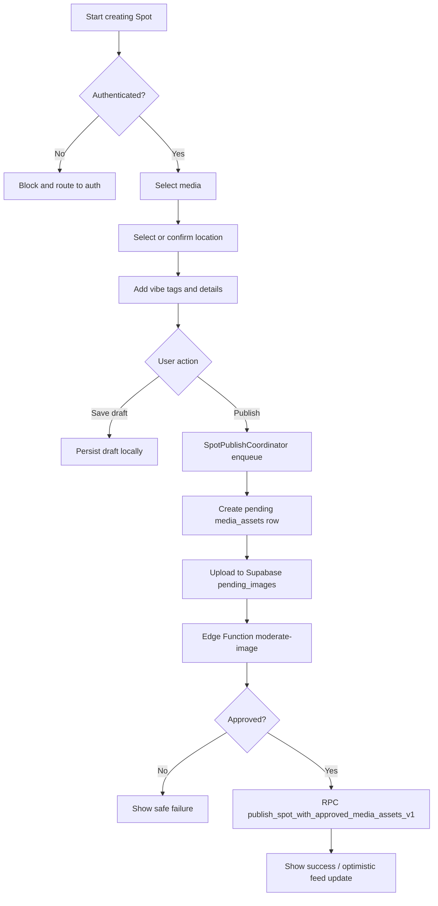

# Posting flow

## Purpose

Describe creating a Spot from the user’s perspective: media, place, vibes, draft, publish, moderation, and failures.

## Audience

Product, engineering, support.

## Current status

Publishing path uses Supabase only: `PostFlowViewModel` → `SpotPublishCoordinator` → `SpotSupabaseRepository.publishSpotFromDraft` (pending Storage upload, Edge Function moderation, RPC `publish_spot_with_approved_media_assets_v1`). See [../engineering/data-plane.md](../engineering/data-plane.md).

## Details

### Overview

User opens **Post** tab → multi-step composer (`Spot/Views/PostFlow`) → selects **photos** → **location** / place → **vibe tags** and **details** → **publish** or save work in progress.

### Media

Photos are chosen from an image-only multi-select library picker or the still-image camera. The first ordered photo is the cover. The photo workspace supports previewing, adding, replacing, removing, accessible reordering, and making any photo the cover.

Each photo has a stable ID and non-destructive edit instructions. Crop, quarter-turn rotation, straightening, horizontal/vertical flip, brightness, contrast, saturation, and warmth are rendered from an orientation-normalized original. The original is retained until publication so edits can be reset or changed without repeatedly recompressing an earlier render. Picker filtering, client decoding, JPEG upload encoding, storage MIME restrictions, and moderation provide layered video exclusion.

Free accounts can publish one photo and one vibe tag. Pro accounts can publish up to five photos and five vibe tags. The publish RPC independently enforces entitlement limits.

### Location

User searches by place, venue, or address, or chooses from nearby MapKit points of interest in `LocationSelectionView`. Nearby results use the latest shared Core Location fix, are ordered by distance, and start within 3 km. The user can expand the nearby search to 8 km, then confirm or adjust the pin before continuing. The selected venue name remains authoritative while the confirmation map settles; reverse geocoding may rename the location only after the pin moves a meaningful distance.

### Vibe tags and caption

User picks from known tags and adds caption/details as the UI allows.

### Draft behavior

`PostDraftStore` persists drafts locally under Application Support, including a reserved `autosave` draft and user-saved drafts. Draft schema version 2 stores each photo's stable ID, durable original and rendered preview, source, ordered position, non-destructive edit instructions, and processing state. Version 1 drafts are migrated lazily when loaded: their known file order is retained, stable IDs are generated, and neutral edits are supplied. A missing version-2 photo file restores as an unavailable item that can be replaced or removed instead of crashing. Draft metadata is indexed locally; no server draft table is involved.

Submission persists a snapshot before JPEG encoding and queueing. The composer resets as soon as `SpotPublishCoordinator` accepts the job, allowing the user to leave the Post tab while the global publish banner reports progress.

### Editing an existing Spot

Edit Spot is a content editor, not a second publishing wizard. It loads the
complete ordered `spot_images` collection even when the feed or map supplied
only a cover image. The editor shows every existing photo in a compact grid;
users can drag to reorder, replace one position, or delete a photo while
retaining at least one. The first item is the cover.

Current vibe tags and location are hydrated with the media. Save is enabled
only after the draft changes and applies ordered media, vibes, and location
together. Replacement photos pass through image moderation; unchanged photos
are not uploaded again. Back navigation asks before discarding dirty edits, and
a failed save preserves the draft for retry.

### Publish and moderation

Every image for Spots must pass **moderation** before being treated as approved media. Client coordinates upload to **pending** storage and server-side moderation; publish completes via RPC when assets are approved.

### Failure states

| Condition | Expected UX (high level) |
| --- | --- |
| Not authenticated | Block publish; route to auth. |
| Upload fails | Error toast; a pre-queue local snapshot normally exists. |
| Moderation rejects | Safe message; do not publish. |
| Supabase insert / RPC fails | Error; preserve draft where applicable. |
| Network unavailable | Retryable error messaging; no offline publish queue. |

The coordinator has a 90-second timeout. A partial multi-image failure can leave approved but unlinked media assets. Current failure handling can also persist the already-reset composer over the earlier autosave, so the “saved to drafts” timeout copy does not guarantee full recovery. Treat this as a known implementation gap, not a recovery contract.

### Flow diagram

## Related docs

- [../engineering/image-moderation.md](../engineering/image-moderation.md)
- [../engineering/storage-and-media.md](../engineering/storage-and-media.md)
- [../diagrams/posting-flow.md](../diagrams/posting-flow.md)

## Open questions / TODOs

- Add orphan-media cleanup and make failed-publish draft recovery transactional before promising guaranteed recovery.
