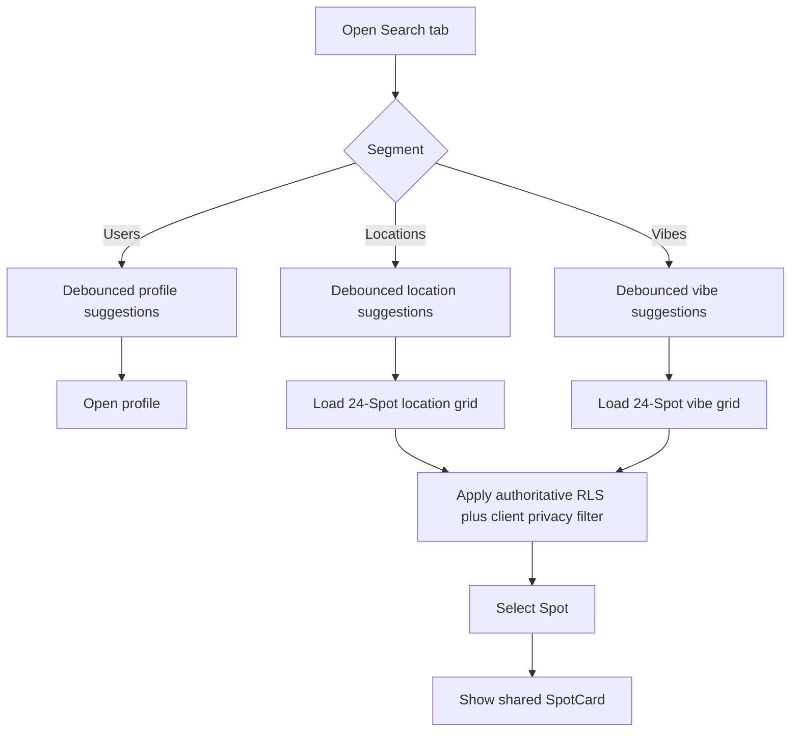

# Search experience

## Purpose

Describe the Search tab, its result types, pagination, privacy handling, and Pro filters.

## Audience

Product, design, engineering, and QA.

## Current status

Verified against `SearchView`, `SearchViewModel`, `SearchService`, and `SpotSearchDataSource` on 2026-07-28.

## Search surfaces

Search has three segments:

| Segment | Suggestions | Selection result |
| --- | --- | --- |
| Users | Prefix-filtered profiles from `users_public` | Opens the selected profile |
| Locations | Distinct `spots.location_name` prefix matches | Opens a paginated Spot grid |
| Vibes | Prefix matches from `vibe_tags` | Opens a paginated Spot grid |

Queries are debounced by 300 ms. Search history is stored per segment by `SearchHistoryManager`.

## Result and detail flow

Location and vibe grids load 24 Spots at a time. Their cursor is a string-encoded offset. Because privacy filtering can remove rows after a page is fetched, `SearchViewModel` may request up to five backend pages to fill one visible page.

A selected grid result is displayed as the shared `SpotCard` presentation inside Search. Spot does not have a separate `SpotDetailView`; the same card presentation is reused by feed, map, profile, Search, and deep-link surfaces.

## Privacy and safety

Supabase RLS and visibility functions are authoritative. `SearchService` additionally uses `AuthorPrivacyCache` to remove blocked or non-viewable private-author results. That cache is additive protection and must never replace server enforcement.

## Pro behavior

Pro users can open location-grid filters and combine a location with selected vibe tags. The filter entry point is hidden for non-Pro users. A vibe result grid does not show the location-plus-vibe filter.

## Loading, empty, and error states

- Initial suggestions and grid loading have separate loading state.
- Empty suggestions and empty Spot grids are represented independently.
- Grid loading deduplicates Spot IDs across pages.
- Privacy-filtered pages can be empty even when the backend returned rows; bounded refetching prevents an endless loop.

## Known limitations

- User search fetches up to roughly 400 public profiles and performs prefix filtering on-device; it is not server-paginated.
- Likes and bookmarks displayed from profile flows are not part of Search pagination.

## Related docs

- [home-feed.md](home-feed.md)
- [profiles-and-social.md](profiles-and-social.md)
- [pro-subscription.md](pro-subscription.md)
- [../engineering/database-and-rls.md](../engineering/database-and-rls.md)
