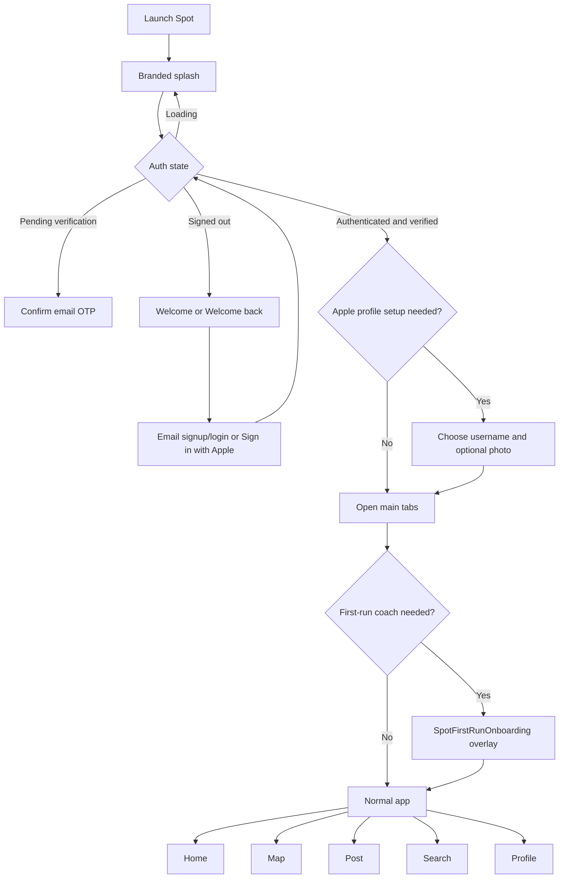

# User flows

## Purpose

Document primary user journeys at a product level with diagrams.

## Audience

Design, product, engineering, QA.

## Current status

Verified against `SpotApp`, `RootView`, the tab shell, `DeepLinkState`, and active onboarding wiring on 2026-07-28.

## Details

### Flows covered

- First launch → branded splash → auth/session gate → required profile setup → main tabs.
- Email signup with six-digit verification, email login, and Sign in with Apple.
- Active first-run coach (`SpotFirstRunOnboardingManager`).
- Home feed with `HomeSpotCard`, map spot drawer, Search, shared detail presentation, and profile/social flows.
- Create Spot → local draft → background publish → moderation gate.
- Pro paywall and purchase return, Universal Link open, and unavailable states.

### High-level app flow

### Deep link (Universal Link) user intent

User taps a shared Spot link → iOS opens Spot → router resolves route → Spot detail or unavailable state (see [../diagrams/universal-links-flow.md](../diagrams/universal-links-flow.md)).

Spot detail is the shared `SpotCard` presentation, not a separate detail screen. Map hosts it in the spot drawer, Search and Profile show it over their grids, and deep links show it over the tab shell.

Home instead renders the place-first `HomeSpotCard`. A user can explicitly flip between its photo face and location snapshot, then choose **Open in Map** from the map face to select the Map tab and focus the same Spot in its spot drawer. See [the Home Spot card flow](../diagrams/home-spot-card-flow.md).

## Related docs

- [onboarding.md](onboarding.md)
- [posting-flow.md](posting-flow.md)
- [map-experience.md](map-experience.md)
- [search-experience.md](search-experience.md)
- [../engineering/runtime-flows.md](../engineering/runtime-flows.md)
- [../diagrams/home-spot-card-flow.md](../diagrams/home-spot-card-flow.md)
- [../diagrams/README.md](../diagrams/README.md)
- [../diagrams/app-launch-auth-flow.md](../diagrams/app-launch-auth-flow.md)

## Open questions / TODOs

- None for the top-level route map; feature-specific limitations are tracked in their respective docs.
